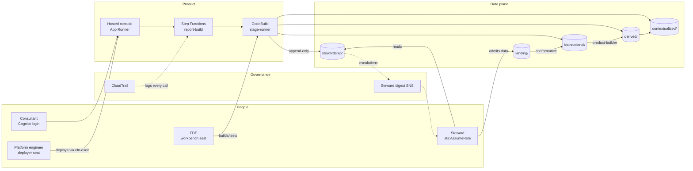
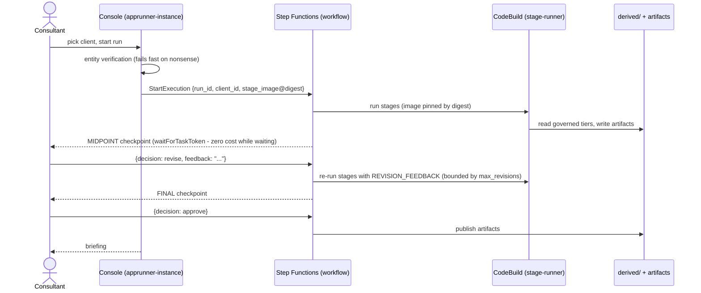
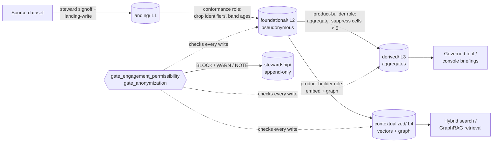
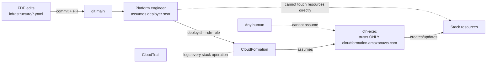
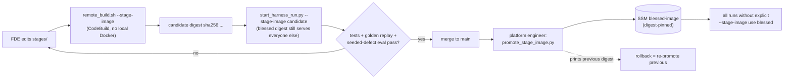
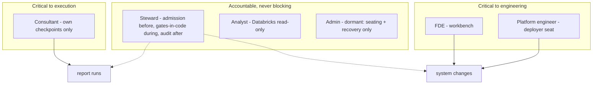
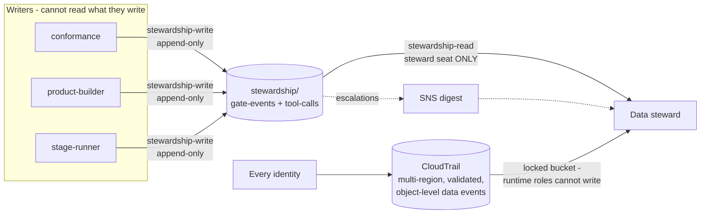
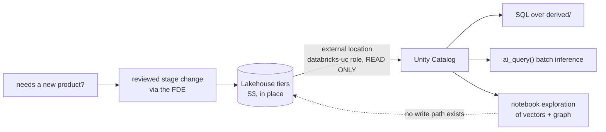
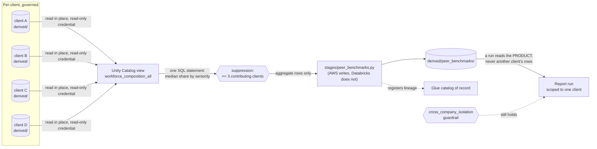

# Architecture diagrams, as source

Every diagram anyone needs to explain this platform, as Mermaid source —
copy any block into a README, a slide tool that speaks Mermaid, the
[Mermaid live editor](https://mermaid.live) (for PNG/SVG export), or GitHub
markdown (which renders these natively). Each diagram maps to one activity
from the [role guides](guides/), so a user standing up a deck for any
audience can start from the block that matches their story.

Conventions: rectangles are identities/surfaces, cylinders are storage,
diamonds are decisions. Names match the deployed resources
(`intelligence-engine-dev-*` prefixes dropped for readability).

---

## 1. The whole system on one page

## 2. A report run, end to end (the consultant's activity)

## 3. Data admission through the medallion tiers (the steward's + data engineer's activity)

## 4. The deploy channel (the platform engineer's activity)

## 5. Pipeline release: candidate → blessed (the FDE + platform engineer handoff)

## 6. The access model at a glance (who can block what)

## 7. The audit surface (the steward's / auditor's activity)

## 8. The analyst's zero-copy path (Databricks)

## 9. Peer benchmarks: crossing clients without breaking isolation

Isolation is preserved because the crossing happens **upstream of any run**
and only a suppressed aggregate survives it. Databricks holds no write path:
it computes, the stage writes, and Glue stays the catalog of record.

---

## Regenerating and extending

- These render natively on GitHub and in the hosted docs; for slide decks,
  paste a block into [mermaid.live](https://mermaid.live) and export SVG/PNG.
- When an activity changes, change its diagram in the same PR — diagrams
  here are documentation of record, reviewed like code.
- To diagram a new activity: copy the closest block, keep the conventions
  (identity → storage → decision shapes; deployed-resource names), and link
  it from the relevant role guide.
